# UX flows: information architecture, role journeys and screen inventory (task M0-U1)

Binding per D-14/`docs/spec/ux-standard.md` and D-16/`docs/spec/mobile-complete.md`. Scope is M1 and M2; M3 (fees, alerts, guardian portal) appears as **placeholder** screens only, since those are specced in `docs/spec/fees-and-alerts.md` (M3-L1) but not yet built. Roles covered per this task's own context (§3 of `M0-U1.md`): institution admin, teacher, accountant, guardian, platform owner. The `student` role exists in `docs/spec/permissions.md` but has no dedicated M1/M2/M3 task building student-facing screens — see §7, open question 1.

No visual design is decided here (M0-U2). No clickable prototypes (M1-U3). This is the map; the design system and prototypes come next.

**Leader resolution to the two open questions raised in this task's report (see `docs/reports/M0-U1.md`):**
1. **Student role, no dedicated UI in v1.** Intentional. Guardians act on a student's behalf (view attendance, results, dues, notices). A student-facing login may be added later (M5 backlog) if pilots ask for it; `permissions.md`'s `student` role stays defined for that future use but is not built against in M1–M3.
2. **Accountant role, no dedicated M1/M2 screens.** Intentional. In M1/M2 the accountant only reads academic structure, students, attendance and results (per `permissions.md`'s matrix) through the same shared, permission-scoped views built for other roles — no separate accountant screen is needed until fee features exist. The accountant's own home and screens arrive with `M3-F1`–`M3-F4` (fee structure, invoicing, payments, reports and the accountant home widget).

## 1. Role homes and top-5 tasks

Project rule (`ux-standard.md` §2): primary tasks reachable within 2 taps of home. "1 tap" means a single tap from the home screen itself (e.g. a button already on home); "2 taps" means one tap to a section (tab bar/sidebar item) plus one tap to the action within it. Home dashboards below are designed with contextual shortcut cards specifically so the *common* case of each top task fits in 2 taps — the Screen inventory (§3) states which task builds each screen.

### 1.1 Institution admin — home: **Setup & status dashboard** (S-010)
Shows, in order: setup-checklist progress (until 100%), anything needing a decision today (exams ready to publish, pending invites, low text-credit balance once M3 exists), then shortcuts to the 5 tasks below.

| # | Task | Taps from home | Path | Screen(s) |
|---|---|---|---|---|
| 1 | Invite a user | 2 | Home → **Users** tab → **Invite** | S-016 |
| 2 | Add or import students | 2 | Home → **Students** tab → **Add** | S-020, S-022, S-023 |
| 3 | Set up an exam | 2 | Home → **Exams** tab → **New exam** | S-040 |
| 4 | Review and publish results | 1 (when a "ready to publish" card is on home) / 3 (cold path: Exams tab → exam → Publish) | Home → **[Publish Term 1]** card, or Home → Exams → exam → Publish | S-045, S-046 |
| 5 | Change institution settings | 2 | Home → **Settings** tab → **Institution** | S-011 |

**Exception, justified:** task 4's cold path (no contextual card yet, e.g. the very first exam an admin ever publishes) is 3 taps: Exams tab → the specific exam → Publish. This is accepted because publishing requires picking *which* exam first when more than one exists, and the home-card shortcut (1 tap) covers the common case once an exam reaches `marks_locked`.

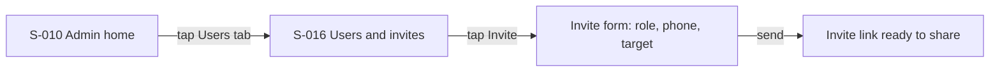
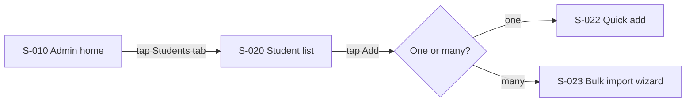
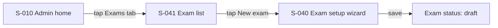
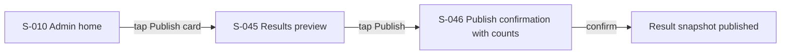
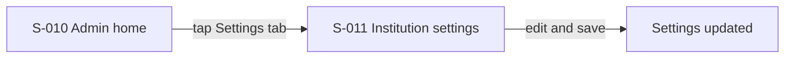

### 1.2 Teacher — home: **Today** (S-030)
Shows today's sections with an attendance-status pill per section (not taken / in progress / done), then any subject with marks currently `marks_open` and an entry count ("18 of 40 entered").

| # | Task | Taps from home | Path | Screen(s) |
|---|---|---|---|---|
| 1 | Take today's attendance | 1 | Home → **[Take attendance]** button on today's section | S-031 |
| 2 | Enter marks for a subject | 1 (when a "marks pending" card is on home) / 2 (cold: Exams tab → subject) | Home → **[Continue marks entry]** card, or Home → Exams → subject | S-043 |
| 3 | View my sections/students | 1 | Home → **Classes** tab | S-020 (scoped), S-021 |
| 4 | Post a notice to my section | 2 | Home → **Notices** tab → **New** | S-050 |
| 5 | View a published result for my class | 2 | Home → **Exams** tab → published exam | S-045 (read-only) |

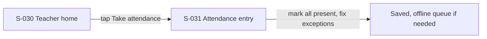
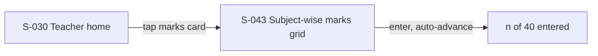
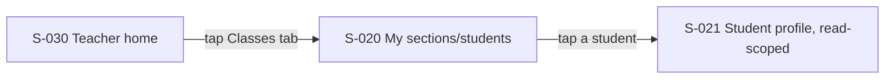
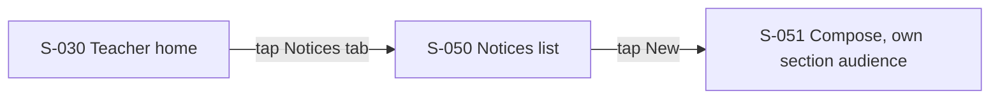
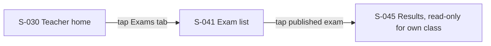

### 1.3 Accountant — home: **Collections today** (S-080, M3 placeholder in M1/M2)
Per `permissions.md`, the accountant role has **no write access anywhere in M1/M2 scope** — only read on students/guardians/enrollments, academic structure, and notices. Real accountant work (fee collection, receipts, dues) is entirely M3 (`M3-F1`–`M3-F4`), so in the M1/M2 period this home is a light read-only dashboard; M3 tasks will add the real content, following `fees-and-alerts.md` §7's permission grants.

| # | Task | Taps from home | Path | Screen(s) | Note |
|---|---|---|---|---|---|
| 1 | Look up a student/guardian | 2 | Home → **Students** tab → search | S-020 (read-only) | Real M1/M2 capability |
| 2 | View institution notices | 1 | Home → **Notices** tab | S-050 (read-only) | Real M1/M2 capability |
| 3 | Collect a fee payment | — | *(M3 placeholder)* | S-081 | Not built until `M3-F3` |
| 4 | View dues/aging report | — | *(M3 placeholder)* | S-082 | Not built until `M3-F2` |
| 5 | View text-alert outbox | — | *(M3 placeholder)* | — | Not built until `M3-T1`/`M3-T2`; `permissions.md` grants accountant read on outbox |

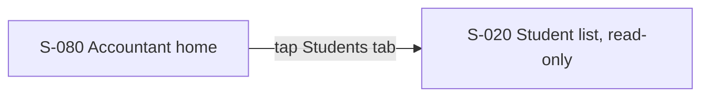
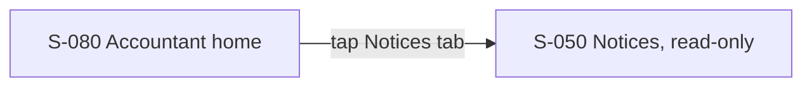

### 1.4 Guardian — home: **Child snapshot** (S-090, M3 placeholder)
Guardian portal is entirely M3 (`M3-G1`, `M3-G2`), per `fees-and-alerts.md` §6. It is documented here as placeholders so the information architecture is consistent end to end, not because this task builds it. Home = a child switcher (if more than one linked child) plus per-child cards: today's attendance, latest published result, dues summary, recent notices.

| # | Task | Taps from home | Path | Screen(s) | Note |
|---|---|---|---|---|---|
| 1 | Check today's attendance | 1 | Home → attendance card | S-091 | M3 placeholder |
| 2 | View latest result / download marksheet | 1 (view) / 2 (download) | Home → result card → download | S-092 | M3 placeholder |
| 3 | Check dues / see a receipt | 1 | Home → dues card | S-093 | M3 placeholder |
| 4 | Read a notice | 1 | Home → notices card | S-094 | M3 placeholder |
| 5 | Switch to another child | 1 | Home → child switcher | S-090 | M3 placeholder |

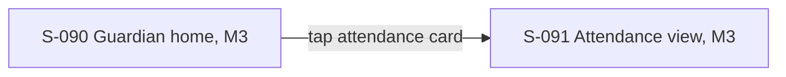
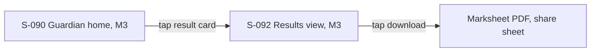
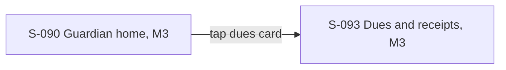
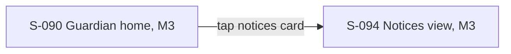
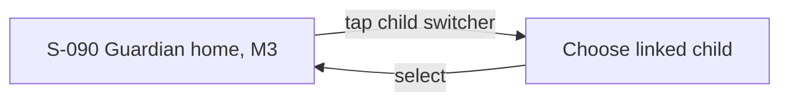

### 1.5 Platform owner — home: **Platform console** (S-003)
Home *is* the institutions list (no separate dashboard screen needed at this scale) with status badges (trial/active/suspended, low credit once M3 exists).

| # | Task | Taps from home | Path | Screen(s) |
|---|---|---|---|---|
| 1 | Open an institution's detail | 1 | Home → tap institution row | S-004 |
| 2 | Impersonate (with reason) | 2 | Home → institution row → **Impersonate** | S-004 |
| 3 | View the audit log | 1 | Home → **Audit** tab | S-006 |
| 4 | Manage plan/credits for an institution | 2 | Home → institution row → **Billing** tab | S-005 |
| 5 | Search institutions by status | 1 | Home → filter chips | S-003 |

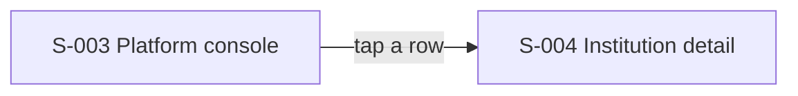
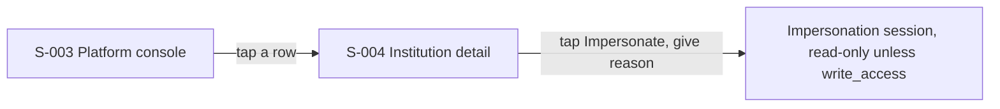
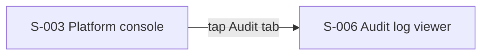
```mermaid
flowchart LR
  A[S-003 Platform console] -->|tap a row| B[S-004 Institution detail]
  B -->|tap Billing tab| C[S-005 Plans and credits]
```
```mermaid
flowchart LR
  A[S-003 Platform console] -->|tap a filter chip| A
```

---

## 2. Navigation map

Uses the `NavItem { key, labelKey, icon, path, roles: Role[] }` contract from `M0-W1.md` §5.2 step 3 — the shell filters one shared registry by the current role, so this section lists the *items*, not a separate nav system per role. Mobile: bottom tab bar, **at most 5 items** (project rule, `ux-standard.md` §2). Desktop: sidebar, same items and order. Labels are Bangla-first with an English alternative (per `ux-standard.md` §5); exact wording is `content-guide.md`'s job (M0-U2), so English glosses below are placeholders, not final copy.

| key | labelKey (Bangla gloss → English) | icon | path | roles |
|---|---|---|---|---|
| `home` | হোম → Home | home | `/home` | institution_admin, teacher, accountant, guardian |
| `students` | শিক্ষার্থী → Students | users | `/students` | institution_admin, teacher (scoped), accountant (read) |
| `attendance` | হাজিরা → Attendance | check-square | `/attendance` | teacher |
| `exams` | পরীক্ষা → Exams | file-text | `/exams` | institution_admin, teacher |
| `users` | ব্যবহারকারী → Users | user-plus | `/settings/users` | institution_admin |
| `settings` | সেটিংস → Settings | settings | `/settings` | institution_admin |
| `notices` | নোটিশ → Notices | bell | `/notices` | institution_admin, teacher, accountant (read), guardian (read, M3) |
| `fees` | ফি → Fees | wallet | `/fees` | accountant (M3 placeholder) |
| `children` | সন্তান → My children | heart | `/parent` | guardian (M3 placeholder) |
| `institutions` | প্রতিষ্ঠান → Institutions | building | `/platform` | platform_owner |
| `audit` | অডিট লগ → Audit | shield | `/platform/audit` | platform_owner |
| `billing` | প্ল্যান ও ক্রেডিট → Billing | credit-card | `/platform/billing` | platform_owner |

### Bottom tab bar per role (≤5 items, mobile)
- **institution_admin:** Home, Students, Exams, Users, Settings (5 — Notices moves inside Settings or a "More" sheet if a 6th item is ever needed; not needed yet in M1/M2).
- **teacher:** Home, Attendance, Exams, Students (scoped to "my classes"), Notices (5).
- **accountant (M1/M2):** Home, Students (read), Notices (read) (3 — Fees/dues tabs are added in M3 without exceeding 5).
- **guardian (M3 placeholder):** Home, Children, Notices (3 — placeholder; final set decided in `M3-U1`).
- **platform_owner (desktop-leaning role, but still phone-complete per D-16):** Institutions, Audit, Billing (3).

### Desktop sidebar
Same items, same order, as a vertical list instead of a bottom bar (`ux-standard.md` §2: "same items, same order, same names across pages").

---

## 3. Screen inventory

IDs are a contract other tasks rely on (§5.3) — do not renumber without Leader approval. "States" lists which of loading/empty/error/locked/offline apply, per `ux-standard.md` §6 and `mobile-complete.md`.

| ID | Name | Role(s) | Route | Purpose | Data shown | Primary action | States | Task |
|---|---|---|---|---|---|---|---|---|
| S-001 | Sign-in | all | `/sign-in` | Authenticate | Phone/username field, password | Sign in | loading, error | M1-P2 |
| S-002 | Invite accept | invited user | `/invite/:token` | Accept invite, set password | Institution name, role | Set password | loading, error (expired/used) | M1-P2 |
| S-003 | Platform console: institutions | platform_owner | `/platform` | List/filter institutions | Name, status, plan | Open institution | loading, empty | M1-P3, M1-W2 |
| S-004 | Institution detail / impersonate | platform_owner | `/platform/institutions/:id` | View one institution, start impersonation | Settings, subscription, recent activity | Impersonate | loading, error | M1-P3, M1-W2 |
| S-005 | Plans and credits | platform_owner | `/platform/institutions/:id/billing` | Manage plan and text-credit ledger | Plan, credit balance, ledger entries | Adjust plan/credit | loading, empty | M1-P3 |
| S-006 | Audit log viewer | platform_owner, institution_admin (own institution) | `/platform/audit` or `/settings/audit` | Inspect who changed what | Actor, action, entity, before/after | Filter/search | loading, empty | M1-P3 |
| S-010 | Admin home | institution_admin | `/home` | Setup status, shortcuts | Checklist %, pending items | Varies (contextual cards) | loading, empty | M1-W5 |
| S-011 | Institution settings | institution_admin | `/settings/institution` | Name, logo, calendar style, holidays | `institution_settings` fields | Save | loading, error | M1-W2 |
| S-012 | Academic years | institution_admin | `/settings/academic-years` | Manage years | Year list, current-year flag | Add year | loading, empty | M1-A1 |
| S-013 | Class levels | institution_admin | `/settings/class-levels` | Manage class levels | Name, order, category | Add/reorder | loading, empty | M1-A1 |
| S-014 | Sections | institution_admin | `/settings/sections` | Manage sections per year/level | Name, shift, class teacher | Add | loading, empty | M1-A1 |
| S-015 | Subjects | institution_admin | `/settings/subjects` | Manage subjects, class-subject links | Name, code, optional flag | Add/link | loading, empty | M1-A1 |
| S-016 | Users and invites | institution_admin | `/settings/users` | Manage memberships, send invites | Name, role, status | Invite | loading, empty | M1-W2, M1-P2 |
| S-017 | Setup checklist | institution_admin | `/setup` | Guided onboarding | Step list with done/skip state | Continue | loading | M1-W5 |
| S-020 | Student list | institution_admin, teacher (scoped), accountant (read) | `/students` | Browse/search students | Name, roll, section, status | Add / open | loading, empty, error | M1-A2 |
| S-021 | Student profile | institution_admin, teacher (scoped), guardian (self, M3), student (self — see §7 Q1) | `/students/:id` | View/edit one student | Personal fields, guardians, enrolment history | Edit | loading, error | M1-A2 |
| S-022 | Quick-add student | institution_admin | `/students/new` | Add one student, "save and add next" | Name, class, guardian phone | Save and add next | loading, error | M1-A2 |
| S-023 | Bulk import wizard | institution_admin | `/students/import` | CSV/XLSX/paste/Munshi import | Preview rows, validation errors | Commit import | loading, error (row-level) | M1-A3, M2-I1 |
| S-024 | Guardian sub-view | institution_admin | `/students/:id/guardians` | Manage a student's guardians | Guardian list, relation, receive_alerts | Add/edit guardian | loading, empty | M1-A2 |
| S-025 | Roll assignment | institution_admin | `/sections/:id/roll` | Assign roll numbers within a section | Student list, roll input | Save | loading, error (duplicate roll) | M1-A2 |
| S-026 | Year rollover wizard | institution_admin | `/settings/academic-years/:id/rollover` | Promote/hold students into next year | Per-student promote/hold/leave choice | Confirm rollover | loading, error | M1-A4 |
| S-030 | Teacher home | teacher | `/home` | Today's sections, attendance and marks status | Section list with status pills | Take attendance / continue marks | loading, empty | M1-W5 |
| S-031 | Attendance entry | teacher | `/attendance/:sectionId` | Mark today's attendance | Roster with present/absent/late/leave | Mark all present, then fix exceptions | loading, offline (queued), error | M2-A5 |
| S-032 | Attendance summary grid | teacher, institution_admin | `/attendance/:sectionId/summary` | Read-only weekly/monthly grid | Sticky name column, date columns | Tap a date to edit (within window) | loading, empty | M2-A5 |
| S-040 | Exam setup wizard | institution_admin | `/exams/new` | Create an exam: classes, subjects, components, grade scheme | Wizard steps | Save (status: draft) | loading, error | M2-E1 |
| S-041 | Exam list | institution_admin, teacher (read) | `/exams` | Browse exams by status | Name, status, class levels | Open / new | loading, empty | M2-E1 |
| S-042 | Grade scheme editor | institution_admin | `/exams/:id/grade-scheme` | Pick/edit a grade-scheme preset | Bands (full-screen sheet on phone) | Save | loading, error | M2-E1 |
| S-043 | Marks entry grid (subject-wise) | teacher (own subjects), institution_admin (any) | `/exams/:id/subjects/:subjectId/marks` | Enter marks for all students in one subject | Name, roll, mark input, "n of 40 entered" | Save (auto per cell) | loading, locked (not marks_open), offline (queued), error (validation) | M2-E2, M1-W4 |
| S-044 | Marks entry, per student (secondary) | teacher, institution_admin | `/exams/:id/students/:studentId/marks` | Review/correct one student's marks across subjects | All components for that student | Save | loading, locked, error | M2-E2 |
| S-045 | Results preview / tabulation | institution_admin, teacher (own class, published only) | `/exams/:id/results` | Review computed results before/after publish | Student cards with rank; tabulation | Publish (admin) | loading, empty | M2-E3 |
| S-046 | Publish confirmation | institution_admin | `/exams/:id/publish` | Confirm publishing, with counts | "This publishes results for 120 students in 3 sections" | Confirm / cancel | loading, error | M2-E3 |
| S-047 | Marksheets: batch, print, share | institution_admin, guardian (own child, M3) | `/exams/:id/marksheets` | Generate/share/print marksheet PDFs | Per-student and merged-class PDF | Share / download / print | loading, error | M2-E4, M0-S1 |
| S-050 | Notices list | institution_admin, teacher, accountant (read), guardian (read, M3) | `/notices` | Browse notices | Title, audience, published date | New (admin/teacher) | loading, empty | M2-C1 |
| S-051 | Notice compose/detail | institution_admin, teacher (own sections) | `/notices/:id` or `/notices/new` | Write/read one notice | Title, body, audience picker | Publish | loading, error | M2-C1 |
| S-070 | Munshi importer wizard | institution_admin | `/import/munshi` | Map and import a Munshi backup | File upload, field mapping, preview | Commit import | loading, error (row-level) | M2-I1 |
| S-080 | Accountant home | accountant | `/home` | Read-only status (M1/M2); fee summary (M3) | Notices, student lookup shortcut | — (M1/M2), Collect (M3) | loading, empty | M1-W5 (home shell); M3-F4 (real content) |
| S-081 | Fee collection | accountant | `/fees/collect` | Quick collect flow | Invoice, amount, method | Record payment | loading, error | **M3 placeholder** — `M3-F3` |
| S-082 | Dues / aging report | accountant, institution_admin | `/fees/dues` | See who owes what | Aging buckets, defaulter list | Export | loading, empty | **M3 placeholder** — `M3-F2`, `M3-F4` |
| S-090 | Guardian home / child switcher | guardian | `/parent` | Snapshot per linked child | Attendance, latest result, dues, notices cards | Switch child | loading, empty | **M3 placeholder** — `M3-G1` |
| S-091 | Guardian: attendance view | guardian | `/parent/attendance` | Read-only attendance calendar | Present/absent/late/leave by date | — | loading, empty | **M3 placeholder** — `M3-G2` |
| S-092 | Guardian: results view | guardian | `/parent/results` | Published results, marksheet download | Per-exam result, marksheet PDF link | Download/share | loading, empty | **M3 placeholder** — `M3-G2` |
| S-093 | Guardian: dues and receipts | guardian | `/parent/dues` | Dues and payment history | Invoice/receipt list | View receipt | loading, empty | **M3 placeholder** — `M3-G2` |
| S-094 | Guardian: notices view | guardian | `/parent/notices` | Notices addressed to this guardian's audience | Notice list | — | loading, empty | **M3 placeholder** — `M3-G2` |

Cross-cutting, not its own screen: a **Help** entry (per `ux-standard.md` §2, WCAG 3.2.6) is a persistent element (bottom-sheet or link) present on every screen above, built once in the shell (`M0-W1`), not re-specified per screen.

---

## 4. New-institution setup journey

From first sign-in to first published result, as a checklist (S-017) the admin can complete in any order except where a real dependency exists (you cannot assign sections before class levels exist, etc.). Each step states whether it can be skipped or deferred.

| Step | Screen | Can skip? | Notes |
|---|---|---|---|
| 1. Sign in (from invite sent during onboarding, `M0-O0`-era) | S-002 → S-001 | No | First action for any admin |
| 2. Institution settings: name, logo, calendar style, holidays | S-011 | **Yes, defer** — sensible defaults exist (`institution_settings` has defaults for most fields per `domain-model.md` §2) | Logo can be added later without blocking anything else |
| 3. Academic year | S-012 | No | Everything else (sections, exams) needs a current year |
| 4. Class levels | S-013 | No | Needed before sections |
| 5. Sections | S-014 | No | Needed before enrolling students |
| 6. Subjects and class-subjects | S-015 | **Partially** — needed before exam setup, but not before adding students | Can be done in parallel with step 7 |
| 7. Add users (teachers, accountant) and invite them | S-016 | **Yes, defer** — admin can do everything alone at first, invite staff later | Not blocking |
| 8. Add/import students, assign rolls | S-020, S-022, S-023, S-025 | No (for the "first published result" goal) | The bulk-import path (S-023) is the realistic path for an existing institution with an existing student list; quick-add (S-022) suits a brand-new institution |
| 9. Exam setup: exam, subjects, components, grade scheme | S-040, S-042 | No | Needed before marks entry |
| 10. Marks entry | S-043 (primary), S-044 (secondary/correction) | No | Requires exam `marks_open` |
| 11. Results preview and publish | S-045, S-046 | No | The journey's end goal |
| 12. (Optional, same session) Marksheets, notices | S-047, S-050 | Yes | Natural next actions, not required for "first published result" |

**Minimum path to "first published result":** steps 3, 4, 5, 6, 8, 9, 10, 11 — 8 of 12 steps; steps 1, 2, 7 can be deferred/skipped, step 12 is after the goal.

---

## 5. Keep, change and drop — Munshi interactions

Reproduced and lightly extended from `docs/research/munshi-flow-analysis.md` §4 (that file is the source of record; this table restates it here so the screen IDs above can reference the decisions directly, per this task's step 5 instruction to "start from the analysis").

| Area | Munshi | SMS decision | Reason | Screens affected |
|---|---|---|---|---|
| Navigation | Drill-down by document: Year → Class → Form | **Change** — persistent role-based nav, ≤2 taps to primary tasks | Several roles, several users, shared data — a one-person drill-down doesn't fit | §2's nav map; S-010, S-030 |
| Home | List of years | **Change** — role home (admin: setup/status; teacher: today; guardian: per child) | Different roles need different first screens | S-010, S-030, S-080, S-090 |
| Marks entry | Per student, all subjects | **Change**, keep as secondary — subject-wise grid is primary (matches how subject teachers actually work); per-student view kept for review/correction | The audit itself and the analysis recommend this split | S-043 (primary), S-044 (secondary) |
| Exam setup | Free-form form builder with computed fields | **Change** — wizard with grade-scheme presets, no free-form computed fields for normal users | The Munshi audit calls the field-type concept non-obvious to first-time users | S-040, S-042 |
| Users | One user | **New** — roles, invites, locks, "who changed this" | SMS is multi-user/multi-role by nature | S-016, S-006 |
| Offline | Fully offline | **Change** — online-first with a queue for attendance and marks, visible sync status | Shared data across devices needs a source of truth | S-031, S-043 |
| Onboarding | First-run tour | **Change** — setup checklist, import wizard, demo data | A checklist suits an admin setting up a real institution better than a tour | S-017 |
| Routing | `HashRouter` | **Change** — normal history routing, shareable links | Needed for deep links (e.g. a shared marksheet link, an invite link) | All routes in §3 |
| Visual language, Bangla typography | Gold/primary tokens, Hind Siliguri/Noto Sans Bengali/SolaimanLipi | **Keep** — carried into `docs/spec/design-system.md` (M0-U2) | Proven to work for this audience already | All screens (typography) |
| Interaction rules (visible primary actions, 44px hit areas, never colour-alone, loading≠not-found, cards on phone, live-count confirmations) | Learned by audit | **Keep** — adopted as binding rules in `ux-standard.md` | Hard-won lessons, no reason to relearn them | All screens |
| Report tables → cards on phone | Present | **Keep** | Already proven | S-032, S-045, S-082 |
| Attendance pills, read-only summary grid | Present/researched | **Keep, re-home** — attendance becomes the teacher's first task of the day (S-030's home card) | Good pattern, just needs a new entry point | S-030, S-031, S-032 |
| Marksheet print fidelity (A4, landscape wide tables) | Present | **Keep the fidelity, change the mechanism** — server-rendered PDF (`M0-S1`) instead of browser print CSS | Phone browsers print poorly (`mobile-complete.md` §4) | S-047 |
| Bulk add by pasting a list ("একসাথে যোগ করুন") | Present, moved to be visible on empty roster | **Keep** — carried into S-023's paste path | Already the right pattern for phone-only student entry | S-023 |
| Terms (মেধাস্থান, স্তর, etc.) | Munshi's own vocabulary | **Keep** — goes into `docs/spec/content-guide.md` (M0-U2) so people moving from Munshi recognise the words | Reduces relearning for existing Munshi users | Content guide, not a screen |

---

## 6. Phone-only journey per role

One row per job in `docs/spec/mobile-complete.md` §3's task matrix (15 jobs total). Every job has a phone flow with no laptop-only step; where the matrix already names the "hard part," this section adds the screen(s) that carry it and any additional pattern this task proposes.

| Job (from `mobile-complete.md` §3) | Role | Phone flow (screens) | Hard part (from the spec) | Proposed pattern (this task) |
|---|---|---|---|---|
| Install and sign in | all | S-001, install guide (built in `M0-W1`) | iPhone install is manual | No new pattern needed; carried from `M0-W1`/`M1-P2` as specced |
| Institution setup, logo | admin | S-017 → S-011 | Cropping/compressing a photo on-device | Logo picker opens camera or gallery, crops to a fixed aspect ratio in-browser before upload, so no server-side crop step blocks the flow |
| Academic structure | admin | S-012, S-013, S-014, S-015 | Many small forms on a small screen | Each is a single-field-per-screen bottom sheet with "add another" inline, rather than one long form — keeps each interaction to one thumb-reachable input at a time |
| Users and invites | admin | S-016 | None named | — |
| Add students | admin, office | S-020, S-022, S-023 | Building a spreadsheet on a phone | S-023's paste path (from Munshi's pattern, §5) avoids ever needing a spreadsheet; quick-add (S-022) with "save and add next" avoids re-navigating per student |
| Attendance | teacher | S-031 | Offline on iPhone (no background sync) | "Mark all present" defaults the whole roster in one tap, then the teacher only touches exceptions — minimises interaction count regardless of sync timing; sync status shown per `ux-standard.md` §6 |
| Exam setup | admin | S-040, S-042 | Complex editor on a small screen | Grade-scheme bands (S-042) open as a full-screen sheet (not an inline table) so each band is edited one at a time |
| Marks entry | teacher | S-043 | Speed and typing errors | Numeric keypad, auto-advance to next student's cell, "n of 40 entered" counter, inline validation against `full_marks` before it can be saved (per `ux-standard.md` §6) |
| Results review | admin, teacher | S-045 | Wide tabulation sheet | Cards with rank/filter/search as primary; a "view as table" toggle for admins who want the wide view, scrollable inside its own container (never the page) |
| Publish | admin | S-046 | None named | Single confirmation naming the real counts, per `ux-standard.md` §6 |
| Marksheets | admin, guardian | S-047 | PDF on phones, printing | Feature-detect `navigator.canShare({ files })` before offering the share-sheet path; always show a download fallback; a "print at a shop" hint when no local printer is detected (heuristic, not guaranteed) |
| Fees (M3) | accountant | S-081 | Speed at a busy counter | *(M3 placeholder — pattern to be set in `M3-U1`, not this task)* |
| Notices and alerts (M3) | admin, teacher | S-050, S-051 | Short Unicode text costs more per message | S-051's compose screen shows a live segment/cost estimate as the admin types, using `countSegments(text)` from `@sms/domain` (per `fees-and-alerts.md` §5) — this is real M2 scope for the notice text itself even though the *sending* mechanism (credits, provider) is M3 |
| Reports and exports | admin | S-032, S-045, S-082 | Excel is rare on phones | PDF/CSV export via share sheet or download, same as marksheets; the on-screen view itself never requires opening a spreadsheet app to be useful |
| Guardian view | guardian | S-090–S-094 | Low digital confidence | *(M3 placeholder)* — child switcher, large cards, Bangla-only by default, "add to home screen" prompt, per `fees-and-alerts.md` §6 |

No job in the matrix has a step that requires a laptop in the flows above.

---

## 7. Open questions for the Owner and for the interviews

1. **Is there a dedicated student-facing UI at all in M1–M3?** `permissions.md` grants the `student` role read-scoped access to their own attendance, marks-adjacent data (published results) and profile, but no task in `docs/tasks/INDEX.md` builds student-facing screens (only `guardian` gets a portal, in M3). Is this intentional (older students share the guardian's device/account) or a gap to raise with the Leader?
2. **Accountant's actual M1/M2 workload** — the permissions matrix gives accountant almost nothing to do before M3. Is an accountant home screen even worth building before M3, or should `M1-W5` simply route them straight to a minimal "nothing yet" state?
3. **Munshi usage pattern (per-student vs per-subject marks entry, and device type)** — `munshi-flow-analysis.md` §6 already asks this; it directly affects whether S-043 (subject-wise) is really the right *primary* screen or whether some institutions will lean on S-044 (per-student) more than assumed. Needs `M0-O1`'s interview findings.
4. **Which Munshi screens are actually used** (same open question as the analysis, §6, question 2) — affects whether the screen inventory above is missing something Munshi users would expect (e.g. Munshi's Comparison card, not carried into this inventory at all).
5. **Notice audience granularity on phones** — S-051's audience picker (all/role/class_level/section, per `domain-model.md` §7) needs a phone-friendly design; is a simple picker (radio + one dropdown) enough, or do institutions need to combine audiences (e.g. "all teachers AND all guardians of section 6A") in one notice? Not decided here — flagged for `M1-U3`'s prototype.
6. **Setup-checklist order enforcement** — §4 lists a minimum path with some hard dependencies (years before sections, etc.); should the UI hard-block out-of-order steps, or just warn and let an admin proceed (e.g. add students before finishing subjects)? A product decision, not decided by this task.
7. **Desktop sidebar necessity for platform_owner** — since D-16 makes every role phone-complete, is a desktop sidebar still worth building first for the platform_owner role (who may realistically use a laptop more often), or should it wait until real usage data says otherwise?
8. **Help entry content** — `ux-standard.md` requires a Help entry in the same place on every screen (§2), but this task does not specify what it contains (FAQ, WhatsApp contact, in-app chat) — a content/ops decision for `M0-U2` or later, not this task.

## Task-specific items
- The 3 decisions you are least sure about:
  1. The exact split of which M1/M2 tasks own which screens when a feature spans workstreams (e.g. S-006 the audit log viewer is listed under both `platform_owner` and `institution_admin` scope, and under `M1-P3`, but `permissions.md` §2 shows institution admins only get "R (own institution)" on `audit_log` — whether that read view is a *separate* screen or a filtered view of S-006 is not decided here.
  2. Whether accountant deserves any dedicated M1/M2 screen at all (open question 2) — this document gives it a minimal placeholder home, but that might be over-building for a role with almost no real M1/M2 permissions.
  3. Whether the "contextual shortcut card" pattern used throughout §1 to keep top tasks within 2 taps (e.g. admin's "ready to publish" card) is realistic to build early, or whether it should itself be treated as a v2 enhancement, with the honest cold-path tap count (often 3) being the real v1 number — flagged as the reasoning behind every "exception" noted in §1.
